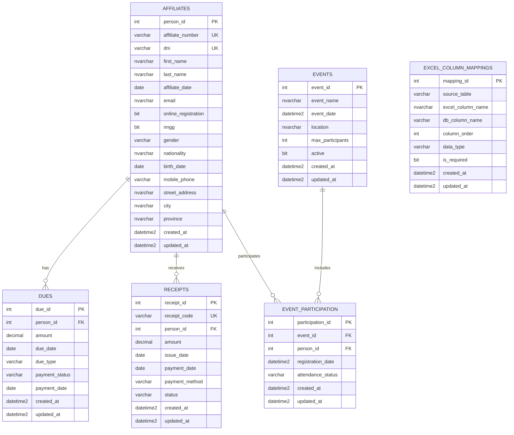

# Application Architecture Design

## 1. Solution Proposal and Technological Architecture

To build a robust, scalable, and modern application, the following technology stack and architecture is proposed:

*   **Backend**: **ASP.NET Core Web API (.NET 9.0)**
    *   **Language**: C#
    *   **Framework**: ASP.NET Core
    *   **Why**: High performance, cross-platform, excellent Azure integration, extensive ecosystem, and mature development tools. Ideal for building secure and efficient RESTful APIs.
*   **Frontend**: **React (with TypeScript)**
    *   **Language**: TypeScript/JavaScript
    *   **Library**: React
    *   **Why**: Popular, component-based, large community, ideal for interactive and dynamic Single Page Applications (SPAs). TypeScript adds static typing for greater robustness.
*   **Database**: **Azure SQL Database**
    *   **Type**: PaaS (Platform as a Service) relational database.
    *   **Why**: Fully managed, scalable, secure, with automatic backups and high availability. Perfect for structured data like contact information.

**Application Architecture:**

The application will follow an N-tier architecture, commonly decoupled:

1.  **Presentation Layer (Frontend - React)**:
    *   Web user interface for administrators to manage affiliate information (CRUD: Create, Read, Update, Delete).
    *   Reusable components for forms, data tables, and navigation.
    *   Communication with the Backend API through HTTP requests (RESTful).
    *   Can be hosted on Azure App Service or Azure Static Web Apps.

2.  **Business Logic and API Layer (Backend - ASP.NET Core Web API)**:
    *   RESTful endpoints for all operations on affiliates (e.g., `GET /api/affiliates`, `POST /api/affiliates`, `PUT /api/affiliates/{id}`, `DELETE /api/affiliates/{id}`).
    *   Data validation.
    *   Business logic (e.g., specific rules for affiliations, youth organization, etc.).
    *   Authentication and authorization (could integrate with Azure AD for administrator users).
    *   Interaction with the data access layer.
    *   Hosted on Azure App Service.

3.  **Data Access Layer (Entity Framework Core)**:
    *   We will use Entity Framework Core as an ORM (Object-Relational Mapper) to interact with Azure SQL Database from the .NET backend.
    *   Definition of data models that map to database tables.

4.  **Persistence Layer (Database - Azure SQL Database)**:
    *   Will store affiliate information.

## 2. Data Model

### Entity-Relationship Diagram (ERD)

### Data Model Description

The data model has been updated to support complete management of affiliates and their interactions with the organization:

1. **Affiliates**: Main table that stores the personal information of affiliates, including contact information, residence details, and affiliation data.

2. **Dues**: Records the dues/fees that each affiliate must pay, including amounts, due dates, and payment statuses.

3. **Receipts**: Maintains a record of payments made by affiliates, with detailed transaction information.

4. **Events**: Stores information about events organized by the organization.

5. **Event Participation**: Relational table that records which affiliates participate in which events.

6. **Excel Column Mappings**: Facilitates data import from Excel files by preserving the relationship between original column names and database field names.

The model is designed to support both daily affiliate management and automated import processes from Excel files. Fields are normalized and use English names to facilitate development, while maintaining a record of the original Spanish names for reference.

For detailed documentation of each table and its fields, please refer to the [Database Schema Document](DATABASE_SCHEMA.md).
