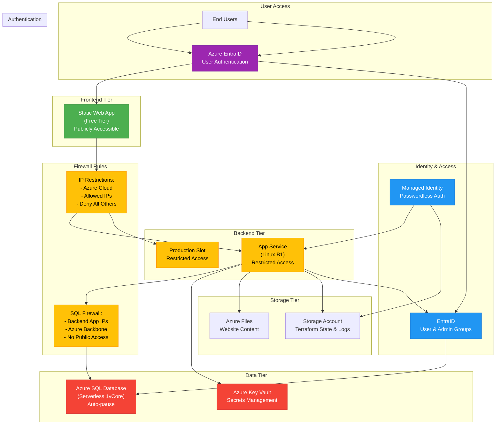

# Azure Infrastructure Design - Cost-Optimized Version

Below is a cost-optimized infrastructure design in Azure for an application with very low simultaneous user count and no high availability requirements:

## Infrastructure Architecture Diagram

1.  **Resource Group**:
    *   A logical container for all Azure resources related to this project, facilitating management and billing.

2.  **Compute**:
    *   **Azure App Service**:
        *   A single **Basic B1 Linux App Service Plan** (aprox. $13.14/month) to host both the ASP.NET Core Backend API and the React Frontend application.
        *   Linux hosting provides significant cost savings compared to Windows plans.
        *   The B1 tier offers 1 core, 1.75 GB RAM which is sufficient for applications with low traffic.
        *   Consider configuring auto-shutdown during non-business hours if applicable to further reduce costs.
    *   **Alternative for Frontend**: Use the free tier of **Azure Static Web Apps** for the React frontend, which is completely free for personal projects and small applications (up to 100GB bandwidth/month).

3.  **Database**:
    *   **Azure SQL Database**:
        *   **Serverless with 1 vCore** configured with auto-pause (after 1 hour of inactivity) to minimize costs during periods of inactivity.
        *   Minimum capacity set to 0.5 vCores for further cost optimization during low usage.
        *   Use standard firewall rules instead of Private Endpoints to reduce costs.
        *   **Azure AD Authentication** enabled with an automatically generated group for SQL administrators (named `[SERVER_NAME]_SQL_ADMINS`).
        *   Backend connection using **passwordless RBAC authentication** via managed identity instead of traditional username/password.

4.  **Networking**:
    *   **Simplified approach** - Eliminate dedicated VNet, Application Gateway, and WAF which add significant costs.
    *   Rely on the built-in SSL/TLS support in Azure App Service for secure HTTPS connections.
    *   Configure CORS in the App Service to control API access from the frontend.
    *   **Firewall Rules and Access Restrictions**:
        *   **Frontend (Static Web App)**: Publicly accessible to allow direct user access.
        *   **Backend API (App Service)**:
            *   IP restrictions configured to only allow traffic from:
                *   Azure Cloud service tag (Azure backbone network)
                *   Optionally, specific allowed IP addresses/ranges configured via variables
            *   Deny-all rule with lowest priority to block all other traffic
            *   Same restrictions applied to both the main app and production slot
        *   **Database (Azure SQL Server)**:
            *   Dynamic firewall rules automatically created for all outbound IP addresses of the Backend App Service using `null_resource` with Azure CLI scripts
            *   Automated management that detects App Service IP changes and updates firewall rules accordingly
            *   Rules are continuously synchronized during deployments to ensure uninterrupted connectivity
            *   Azure backbone access allowed via the "0.0.0.0" rule to enable private endpoint connections
            *   No general "Allow all Azure services" rule, ensuring precise access control
    *   This tiered approach ensures the frontend remains publicly accessible while the backend API and database are protected, with communication between services restricted to Azure's internal network.

5.  **Identity and Security**:
    *   **Azure EntraID (Azure AD - Free tier)**:
        *   **End-user authentication**: Configure application registration to enable end users to authenticate securely to the application.
        *   **Role-based access control**: Define user roles (e.g., regular users, administrators) for implementing proper authorization.
        *   **Service authentication**: Implement passwordless RBAC authentication using managed identities for secure service-to-service communication.
        *   **Administrative groups**: Create EntraID groups to manage SQL Server administrators and application administrators centrally.
        *   **Single sign-on**: Enable seamless authentication experience across the application.
        *   **Conditional access policies**: Configure access based on user identity, device, location, and risk signals (subject to appropriate license).
    *   **Azure Key Vault (Standard tier)**:
        *   Used to securely store and manage sensitive credentials (particularly SQL Server admin password).
        *   Password for SQL admin is automatically generated during deployment and stored securely.
        *   Access policies configured to provide least-privilege access to services using managed identities.
        *   Store application secrets and certificates used for secure communication.
        *   Network rules configured to limit access, with dynamic whitelist management:
            *   CI/CD pipelines automatically add and remove GitHub runner IPs during deployments
            *   Existence verification before rule modifications to ensure robust deployment process
            *   Temporary, just-in-time access for deployment operations with automatic cleanup

6.  **Monitoring and Logging**:
    *   **Minimalist approach to Azure Monitor**:
        *   Use the free tier of Application Insights with sampling configured to 5% to maintain visibility while minimizing data ingestion costs.
        *   Rely on built-in App Service logs and metrics which are available at no additional cost.
        *   Skip Log Analytics Workspace to reduce costs.
        *   Configure only truly critical alerts to avoid unnecessary notifications.

7.  **DevOps (CI/CD)**:
    *   **GitHub Actions** (free for public repositories):
        *   Use GitHub for source control and CI/CD which has a generous free tier.
        *   Implement simple deployment workflows directly to Azure App Service.
        *   Use deployment slots only when truly necessary, as they consume additional compute resources.
        *   **Enhanced Infrastructure as Code pipeline**:
            *   Reusable workflows to eliminate code duplication and improve maintainability
            *   OIDC authentication for secure, passwordless access to Azure without long-lived credentials
            *   Automated validation, security scanning, and intelligent deployment strategies
            *   Robust resource existence verification before attempting configuration changes
            *   Environment-specific configuration and conditional deployment controls

8.  **Storage**:
    *   Instead of dedicated Blob Storage, leverage the local file system storage included with your App Service Plan for smaller files.
    *   If external storage is needed, use the lowest tier of Azure Blob Storage (LRS redundancy, cool access tier for infrequently accessed data).
    *   Create separate storage accounts for website content using Azure Files for content mounting in App Service.

**Estimated Monthly Costs (Northeurope region)**:

| Service | Tier | Monthly Cost (EUR) |
|---------|------|----------------|
| Azure App Service | B1 Linux | €11.83 |
| Azure Files Storage | Standard LRS | €1.75 |
| Azure Storage Account | Standard LRS | €0.95 |
| Azure Key Vault | Standard | €0.85 |
| Azure Active Directory | Free tier | €0 |
| Azure Monitor/App Insights | Free tier | €0 |
| GitHub Actions | Free tier | €0 |
| **TOTAL (with Basic SQL)** | | **€19.88** |

**Current Configuration Using SQL Database Serverless with Auto-pause:**

| Service | Tier | Monthly Cost (EUR) |
|---------|------|----------------|
| Azure App Service | B1 Linux | €11.83 |
| Azure SQL Database | Serverless (1 vCore, 0.5 min) with auto-pause | €5.50-8.75* |
| Azure Files Storage | Standard LRS | €1.75 |
| Azure Storage Account | Standard LRS | €0.95 |
| Azure Key Vault | Standard | €0.85 |
| Azure AD App Registration | Free tier | €0 |
| Azure Monitor/App Insights | Free tier | €0 |
| GitHub Actions OIDC | Free tier | €0 |
| **TOTAL** | | **€20.88-24.13** |

*Serverless database cost depends on active hours; with auto-pause configured to activate after 1 hour of inactivity. Cost is reduced by setting minimum capacity to 0.5 vCores during low usage periods.

**Cost Management & Monitoring**:

1. **Budget Controls**:
   * Monthly budget configured at €25 (slightly above expected costs to allow for flexibility)
   * Automated email notifications set at 70%, 90%, and 100% of budget threshold
   * Budget defined at resource group level to accurately track all project resources

2. **Cost Optimization Tips**:
   * Regularly review usage patterns and scale down resources if they're over-provisioned
   * Consider turning off development/testing resources when not in use
   * Use Azure Cost Management to monitor spending trends and detailed cost breakdowns

## Private Network Architecture Analysis

An analysis has been conducted to evaluate the implications of implementing a private networking architecture to enhance security by restricting traffic between components to Azure's private network rather than public internet.

### Key Components Required for Private Networking

1. **Azure Virtual Network (VNet)**:
   * Required to create private network boundaries within Azure
   * Would host all resources in a single private network space

2. **Private Endpoints**:
   * Required for each PaaS service (Static Web App, App Service, SQL Database)
   * Enables private IP communication within the VNet

3. **NAT Gateway**:
   * Provides outbound internet connectivity for resources in the VNet
   * Required for services to access external dependencies

4. **Private DNS Zones**:
   * Required for DNS resolution of private endpoints
   * Maps service FQDNs to private IP addresses

### Service Tier Requirements

Some services require higher tiers to support Private Link functionality:

* **Static Web Apps**: Must be upgraded from Free to Standard tier
* **App Service**: Supported on Basic tier and above (no change required)
* **SQL Database**: Supported on Basic tier and above (no change required)

### Cost Comparison Table: Current vs. Private Network

| Service | Current Plan | Current Monthly Cost | Plan Required for Private Network | Monthly Cost with Private Network | Increase |
|----------|-------------|----------------------|-----------------------------------|--------------------------------|------------|
| **Azure Static Web Apps** | Free | €0 | Standard | €9/month | +€9 |
| **App Service Plan** | Basic B1 | €11.83/month | Basic B1 (minimum) | €11.83/month | €0 |
| **Azure SQL Database** | Serverless (1 vCore) | €5.50-8.75/month | Serverless (1 vCore) | €5.50-8.75/month | €0 |
| **Azure Storage Account** | Standard LRS | €0.95/month | Standard LRS | €0.95/month | €0 |
| **Azure Files** | Standard LRS | €1.75/month | Premium LRS | €5.50/month | +€3.75 |
| **Azure Key Vault** | Standard | €0.85/month | Standard | €0.85/month | €0 |
| **Application Insights** | Free | €0 | Free | €0 | €0 |
| **Private Endpoints (3)** | N/A | €0 | 3 endpoints | €21.90/month | +€21.90 |
| **Data Processing** | N/A | €0 | Estimated 500 GB | €40/month | +€40 |
| **NAT Gateway** | N/A | €0 | Standard | €32.85/month | +€32.85 |
| **Azure Virtual Network** | N/A | €0 | Basic | €0 | €0 |
| **Private DNS Zone** | N/A | €0 | Standard | €0.50/month | +€0.50 |
| **Total** | | **€20.88-24.13/month** | | **€136.03-139.28/month** | **+€115.15** |

### Security Benefits of Private Network

1. **Enhanced Security Posture**:
   * Communication between services remains on Microsoft's backbone network
   * Resources not exposed to public internet reducing attack surface
   * Protection against exfiltration of sensitive data

2. **Compliance Advantages**:
   * Meets stringent regulatory requirements for data privacy
   * Better control over data pathways and access points
   * Improved audit capabilities for network traffic

### Considerations and Tradeoffs

1. **Cost Impact**:
   * Approximately 5.8x increase in monthly infrastructure costs
   * Most significant cost increases are from NAT Gateway and data processing charges

2. **Architectural Limitations**:
   * Static Web Apps lose global distribution when using private endpoints
   * Additional complexity in network configuration and management
   * Requires more specialized DevOps skills for maintenance

3. **Implementation Strategy**:
   * Consider implementing private networking only for production environments
   * Potential hybrid approach with only the database using private endpoints
   * Could be implemented in phases as usage and security requirements evolve
